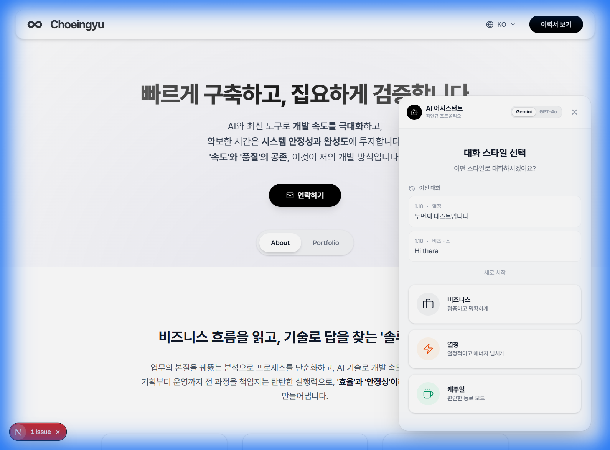

<div align="center">

# 최인규 | Ingyu Choe

**비즈니스 흐름을 읽고, 기술로 답을 찾는 솔루션 빌더**

[](https://github.com/CHOEINGUY/choeingyu/actions/workflows/ci.yml)
[](https://nextjs.org/)
[](https://react.dev/)
[](https://www.typescriptlang.org/)
[](https://tailwindcss.com/)
[](https://firebase.google.com/)
[](https://vitest.dev/)

[Live Demo](https://choeingyu.vercel.app) · [이력서](https://choeingyu.vercel.app/resume) · [Contact](mailto:chldlsrb07@gmail.com)

</div>

---

## ✨ 주요 특징

| 기능                   | 설명                                                         |
| ---------------------- | ------------------------------------------------------------ |
| 🎭 **인터랙티브 데모** | 각 프로젝트의 핵심 로직을 실시간으로 시연하는 자동 재생 데모 |
| 🌍 **다국어 지원**     | 한국어/영어 완벽 지원 (next-intl)                            |
| 📱 **반응형 디자인**   | 모바일부터 데스크톱까지 최적화된 UX                          |
| 🖨️ **프린트 최적화**   | 이력서 페이지 인쇄 시 깔끔한 레이아웃 유지                   |
| ⚡ **최신 기술 스택**  | Next.js 16, React 19, Tailwind v4 적용                       |

---

## 🚀 프로젝트 하이라이트

### 1. 통합 이벤트 관리 솔루션

> 파티/소개팅/1:1 등 다양한 사업 모델을 JSON 엔진으로 동적 처리

- **문제**: 사업 모델마다 별도 개발 필요
- **해결**: 동적 폼 빌더 + 입금 자동 확인 + 알림톡 발송 자동화
- **성과**: 1인 운영 체제 확립, 휴먼 에러 최소화

### 2. 역학조사 통합 분석 솔루션 (Easy-Epidemiology)

> 보건소 담당자의 수작업 분석을 즉시 자동화

- **문제**: 환자 대조군 분석 및 보고서 작성에 수 시간 소요
- **해결**: 브라우저 기반 경량 통계 알고리즘 + 한글/PDF 자동 생성
- **성과**: 분석 시간을 '즉시 완료' 수준으로 단축

### 3. 실시간 코호트 검진 관제 시스템

> 검진 현장 병목 해소 및 대기 시간 최적화

- **문제**: 수기 관리로 인한 현장 혼선
- **해결**: Firebase 실시간 연동 + Google TTS 자동 호명
- **성과**: 검진 회차당 소요 시간 15% 단축

---

## 🛠️ 기술 스택

### Frontend

```
Next.js 16 · React 19 · TypeScript 5 · Tailwind CSS 4
Framer Motion · Recharts · Lucide Icons
```

### Backend & Infrastructure

```
Firebase (Auth, Firestore, Realtime DB)
Google Cloud Run · Vercel · Cloudflare R2
```

### Development & Testing

```
Vitest · React Testing Library · ESLint
next-intl (i18n) · react-hook-form
```

---

## 📁 프로젝트 구조

```
src/
├── app/                    # Next.js App Router
│   └── [locale]/           # 다국어 라우팅
│       ├── page.tsx        # 랜딩 페이지
│       ├── resume/         # 이력서
│       └── portfolio/      # 포트폴리오 상세
├── features/               # 기능별 모듈
│   ├── hero/               # Hero 섹션
│   ├── portfolio/          # 포트폴리오 컴포넌트
│   │   └── projects/       # 개별 프로젝트 데모
│   └── resume/             # 이력서 컴포넌트
├── components/             # 공통 UI 컴포넌트
├── hooks/                  # 커스텀 훅
├── lib/                    # 유틸리티
└── messages/               # i18n 번역 파일
```

---

## 🚀 빠른 시작

```bash
# 저장소 클론
git clone https://github.com/CHOEINGUY/choeingyu.git
cd choeingyu

# 의존성 설치
npm install

# 개발 서버 실행
npm run dev

# 테스트 실행
npm run test
```

**http://localhost:3000** 에서 확인

---

## 🤖 AI 도구 활용

> 바이브코딩 / AI Workflow 직렬 지원자로서의 역량

| 활용 영역     | 도구                   | 적용 사례                                               |
| ------------- | ---------------------- | ------------------------------------------------------- |
| **코드 생성** | Cursor, GitHub Copilot | 복잡한 애니메이션 로직, 데모 컴포넌트 빠른 프로토타이핑 |
| **디버깅**    | Claude, ChatGPT        | 에러 트러블슈팅, 성능 최적화 분석                       |
| **문서화**    | AI 어시스턴트          | 코드 주석, README 작성, 번역                            |
| **자동화**    | SAS/Python/VBA + AI    | 14개 통계집 보고서 자동 생성 (3개월 → 1개월)            |

**핵심 철학**: AI로 개발 속도를 높이고, 확보한 시간은 **현장 검증과 안정성 테스트**에 투자

---

## 📸 미리보기

<div align="center">
  
</div>

---

## 📬 연락처

- **Email**: chldlsrb07@gmail.com
- **GitHub**: [@CHOEINGUY](https://github.com/CHOEINGUY)
- **Phone**: 010-3323-7008

---

## 📄 라이선스

이 프로젝트는 개인 포트폴리오 용도로 제작되었습니다.

---

<div align="center">
  <sub>Built with ❤️ by Ingyu Choe</sub>
</div>
